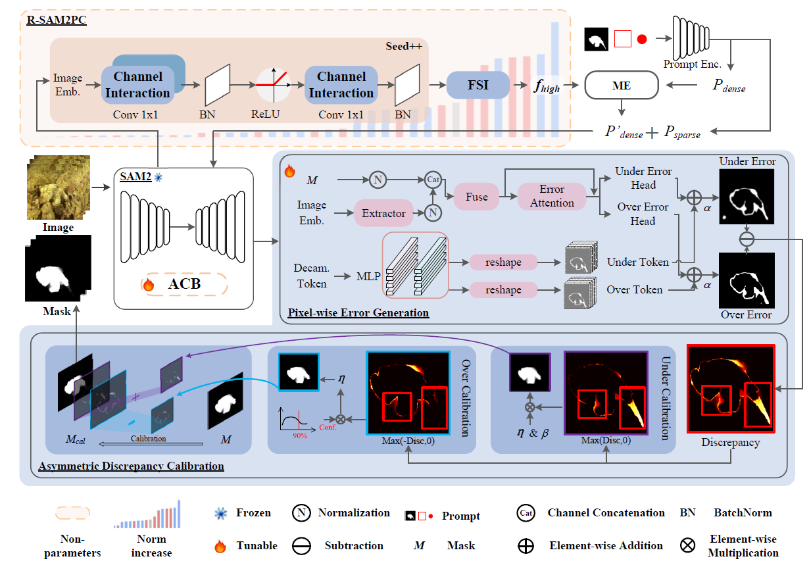
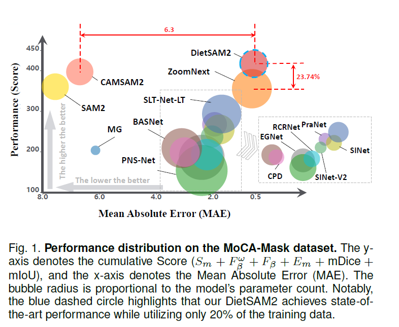
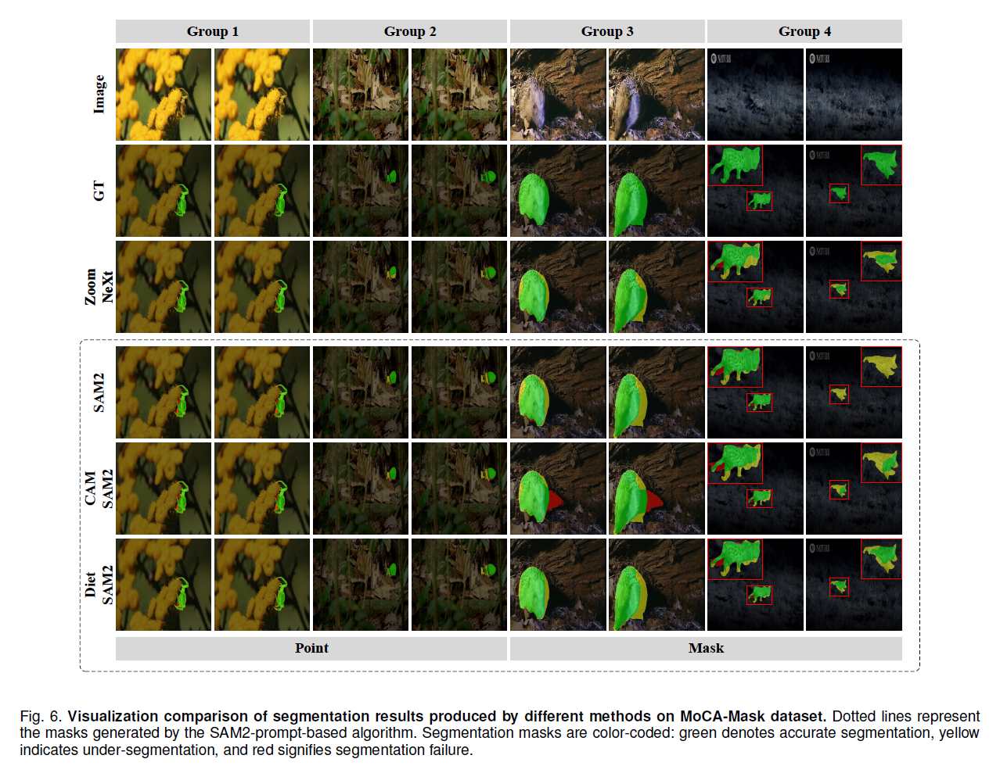
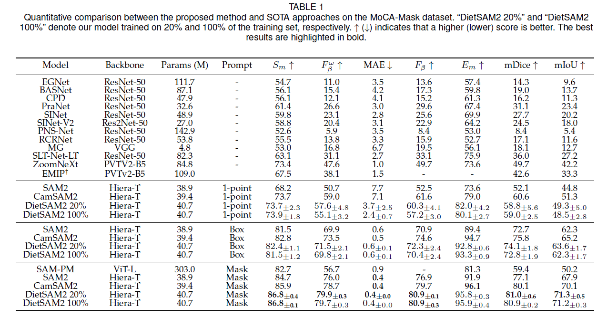
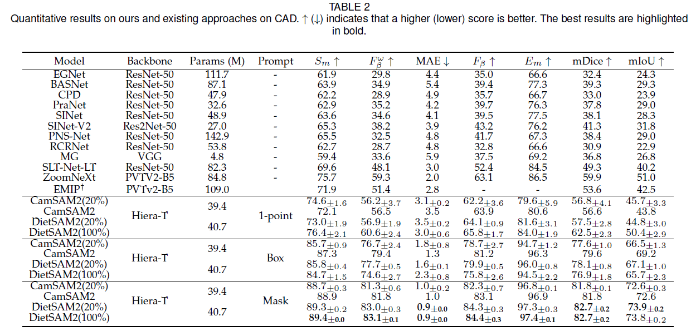
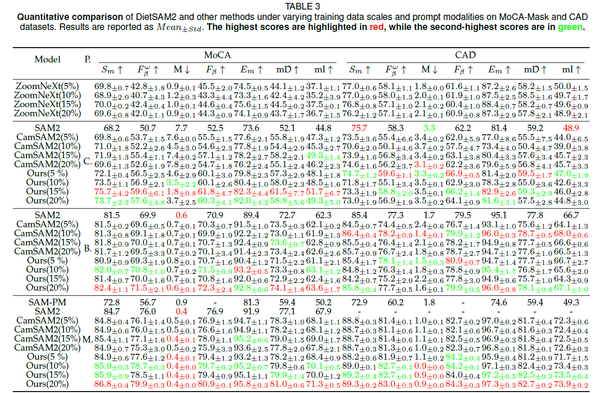

# DietSAM2

## SAM2 on a Diet: Unlocking Massive Potential with Minimal Data for Semi-supervised Video Camouflaged Object Detection

**Zhenni Yu, Guobao Xiao, Xiaoqin Zhang, Lianghua He**  
**IEEE Transactions on Pattern Analysis and Machine Intelligence (TPAMI), 2026**

[Paper](https://doi.org/10.1109/TPAMI.2026.3734688) · [Overview](#overview) · [Results](#results) · [Getting started](#getting-started) · [Citation](#citation)

This repository provides training and evaluation code for **DietSAM2**, a data-efficient adaptation framework for semi-supervised video camouflaged object detection. DietSAM2 combines **Reverse SAM2 Parameter Configuration (R-SAM2PC)** with **Pixel-wise Error Discrepancy Calibration (PixCal)** to adapt SAM2 to camouflaged targets under limited supervision.

## Overview

- **Data-efficient adaptation:** the paper investigates training with 5%, 10%, 15%, and 20% of the training data, alongside full-supervision comparisons.
- **Complementary components:** R-SAM2PC adapts feature representations, while PixCal addresses under- and over-segmentation.
- **Prompt-based video segmentation:** evaluation supports point, box, and mask prompts on the first frame.

R-SAM2PC and PixCal operate in the single-frame spatial domain; they do not introduce explicit temporal modeling. Video propagation uses the underlying SAM2 framework.

<p align="center">
  
</p>

### Performance and data efficiency

<p align="center">
  
</p>

The paper's MoCA-Mask comparison places DietSAM2 trained with 20% of the data alongside existing approaches. The plotted score sums six metrics; it is not a single accuracy measure. Bubble size represents model parameter count.

## Results

The following are **paper-reported results**, not the results of a newly executed reproduction run. Values below are on the percentage scale; the ± values are standard deviations over three independent runs.

### Mask-prompt summary (20% training data)

| Dataset | S-measure ↑ | Weighted F-measure ↑ | MAE ↓ | F-measure ↑ | E-measure ↑ | mDice ↑ | mIoU ↑ |
| --- | --- | --- | --- | --- | --- | --- | --- |
| MoCA-Mask | 86.8 ± 0.4 | 79.9 ± 0.3 | 0.4 ± 0.0 | 80.9 ± 0.1 | 95.8 ± 0.3 | 81.0 ± 0.6 | 71.3 ± 0.5 |
| CAD | 89.3 ± 0.2 | 83.0 ± 0.3 | 0.9 ± 0.0 | 84.3 ± 0.3 | 97.3 ± 0.3 | 82.7 ± 0.2 | 73.9 ± 0.2 |

### Qualitative comparison



Green indicates correct segmentation, yellow indicates under-segmentation, and red indicates segmentation failure, following the paper's figure legend. The examples include point and mask prompts.

### Full quantitative comparisons

Expand each table, or open its image to inspect the values at full resolution.

<details>
<summary><b>MoCA-Mask: comparison with existing approaches</b></summary>



</details>

<details>
<summary><b>CAD: comparison with existing approaches</b></summary>



</details>

<details>
<summary><b>Data efficiency: 5%, 10%, 15%, and 20% training data</b></summary>



</details>

## Repository structure

```text
DietSAM2/
├── assets/              # README figures
├── sam2/                # Evaluation model and DietSAM2 predictors
├── sam2_configs/        # Model configurations
├── train/               # MoCA training and ablation entry points
│   ├── sam2/            # Training-specific SAM2 implementation
│   └── utils/
├── train_sun/           # SUN-SEG training with its local dependencies
├── scripts/             # Evaluation, CAD preparation, metric aggregation
├── setup.py
└── pyproject.toml
```

Keep the local `sam2/` packages inside `train/` and `train_sun/`: they are required by the corresponding training scripts. This release focuses on training and evaluation; parameter-analysis and figure-generation scripts are not included.

## Getting started

### Environment

Use Linux with a CUDA-capable NVIDIA GPU and a compatible PyTorch / torchvision / FlashAttention installation. FlashAttention in the current decoder requires CUDA; CPU-only evaluation is not supported.

The inherited packaging declares Python >= 3.10, PyTorch >= 2.3.1, and torchvision == 0.18.1. These declarations are not a fully pinned reproduction environment. Check compatibility before installation; the tested environment specification is pending completion.

```bash
# Run from the repository root in your prepared environment.
python -m pip install -v -e .
python -c "import torch; assert torch.cuda.is_available(), 'CUDA is required'; print(torch.cuda.get_device_name(0))"
```

### Data and checkpoints

Obtain the datasets from their respective providers and respect their licenses. Data and weights are not bundled with the source code.

#### MoCA training subsets

Each archive contains the 5%, 10%, 15%, and 20% training subsets for one data-selection seed, including images and annotations. These seeds identify dataset splits, not necessarily the training random seeds.

| Data-selection seed | Subset ratios | Download (Baidu Netdisk) | Extraction code |
| --- | --- | --- | --- |
| 42 | 5%, 10%, 15%, 20% | [DietSAM2_seed42_20261005_074057.zip](https://pan.baidu.com/s/151LzUhWEHdfLrbNSJswKLg?pwd=tdi3) | `tdi3` |
| 456 | 5%, 10%, 15%, 20% | [DietSAM2_seed456_20261005_074057.zip](https://pan.baidu.com/s/1Py1uhBpLE2qyWaGu_UHbaw?pwd=w24i) | `w24i` |
| 789 | 5%, 10%, 15%, 20% | [DietSAM2_seed789_20261005_074057.zip](https://pan.baidu.com/s/1o6PMEOevIaHZlWGBsZWz8w?pwd=eeua) | `eeua` |

After extraction, set `--data_path` to the desired ratio folder, for example
`/path/to/DietSAM2_seed456/seed456_ratio20`, rather than its parent directory.
These archives contain training subsets; MoCA-Mask, CAD, and SUN-SEG evaluation
data must be prepared separately. Links are author-provided; download integrity
and archive checksums have not yet been independently verified here.

#### Model checkpoints

| Checkpoint | Download (Baidu Netdisk) | Extraction code | Local path |
| --- | --- | --- | --- |
| Pretrained SAM2.1 Hiera-Tiny (training initialization) | [sam2.1_hiera_tiny.pt](https://pan.baidu.com/s/1uKt-B47WpVKhF8X0ixC4Ow?pwd=xumi) | `xumi` | `checkpoints/sam2.1_hiera_tiny.pt` |
| Trained DietSAM2 | [DietSAM2.pth](https://pan.baidu.com/s/1kLZRdboVi2cQ3_wFDAVy1A?pwd=cc8q) | `cc8q` | `checkpoints/DietSAM2.pth` |

Download the trained checkpoint and pass `--ckpt_path checkpoints/DietSAM2.pth`
when evaluating MoCA-Mask or CAD from the repository root. The supplied local
checkpoint has passed strict parameter-name and tensor-shape loading checks
against the release model. This check verifies structural compatibility, not
numerical reproduction of the paper results. The hosted file's checksum has not
yet been published.

The trained DietSAM2 checkpoint is for evaluation. The pretrained SAM2.1
Hiera-Tiny checkpoint initializes training; it is not the trained DietSAM2
model. Download the required file from the table above and place it at the
specified local path. The training-subset archives contain data, not weights.

The current Tiny training entry points expect the pretrained checkpoint at:

```text
checkpoints/sam2.1_hiera_tiny.pt
```

Use the checkpoint version expected by the code; do not silently substitute a different SAM2 checkpoint.

#### Download predicted masks

| Evaluation dataset | Download (Baidu Netdisk) | Extraction code |
| --- | --- | --- |
| MoCA-Mask | [DietSAM2_subset456_epoch16_MoCA_predictions.zip](https://pan.baidu.com/s/16AXf4se4jQvGtlldxTlFKg?pwd=7r6n) | `7r6n` |
| CAD | [DietSAM2_subset456_epoch16_CAD_predictions.zip](https://pan.baidu.com/s/1XXKjQK3zxy3JXXmXia-mUg?pwd=vrqv) | `vrqv` |

These prediction archives come from the **20% MoCA training subset with
data-selection seed 456, training seed 42, and epoch 16**. Each archive contains
binary predicted masks for mask, box, and point prompts. White (255) represents
foreground and black (0) represents background. They contain predictions, not
input images, ground-truth masks, or model weights.

```text
MoCA/ or CAD/
├── mask_prompt/<video_name>/<mask_file>
├── box_prompt/<video_name>/<mask_file>
└── click_prompt/<video_name>/<mask_file>
```

The predictions represent one run, not the three-run mean reported in the
paper. The shared `DietSAM2.pth` is the same subset456 epoch-16 checkpoint used
to generate these prediction archives, renamed for release; only the filename
was changed, not the model parameters.

#### Directory layouts

Training data (MoCA and SUN):

```text
TRAIN_ROOT/sequence_name/Frame/*.jpg
TRAIN_ROOT/sequence_name/GT/*.png
```

MoCA / prepared CAD evaluation data:

```text
TEST_ROOT/sequence_name/Imgs/   # JPG, JPEG, or PNG frames
TEST_ROOT/sequence_name/GT/    # Corresponding masks
```

SUN evaluation uses `Frame/` and `GT/` inside each case. Inspect the SUN loader's filename requirements before using unprocessed data; it expects numerically named frame stems. Image/mask correspondence and ordering must be preserved.

For CAD in the original `filtered_frames` / `new_gt` layout, `scripts/prepare_CAD_eval.py` creates the required evaluation layout using symbolic links:

```bash
python scripts/prepare_CAD_eval.py --source /path/to/CAD_original --output /path/to/CAD_eval
```

### Train on a MoCA subset

Run from the repository root. Replace the example data path with your prepared subset. The script does **not** automatically select 20% of the data. The subset-selection seed and training seed are different settings.

```bash
REPO_ROOT="$PWD"
cd train
export PYTHONPATH="$REPO_ROOT/train:$REPO_ROOT"

CUDA_VISIBLE_DEVICES=0 python -m torch.distributed.run \
  --standalone --nnodes=1 --nproc_per_node=1 \
  train_dietsam2.py \
  --data_path /path/to/MoCA_20percent_subset \
  --output ../outputs/moca20_seed42/ \
  --model_type hiera_tiny --num_frames 8 --seed 42 \
  --learning_rate 0.001 --lr_drop_epoch 5 \
  --max_epoch_num 18 --batch_size_train 5
```

Use a fresh output directory for each run. Single-GPU training still uses the distributed launcher. New checkpoint filenames use `DietSAM2_epoch_*_merged.pth`; existing `CamSAM2_epoch_*_merged.pth` checkpoints remain loadable by their actual paths.

For SUN-SEG, start from the repository root, enter `train_sun/`, set `PYTHONPATH` to `"$REPO_ROOT/train_sun:$REPO_ROOT"`, and use `train_dietsam2_sun.py` with the SUN training path. Do not label a subset run as a full-data experiment.

### Evaluate on MoCA-Mask or CAD

Run from the repository root and reset `PYTHONPATH` so evaluation imports the root model rather than the training-specific model:

```bash
export PYTHONPATH="$PWD"
CUDA_VISIBLE_DEVICES=0 python scripts/eval_MoCA-Mask.py \
  --model_cfg sam2_hiera_t.yaml \
  --ckpt_path checkpoints/DietSAM2.pth \
  --data_path /path/to/TEST_ROOT \
  --output_mode combined_mask \
  --prompt_types mask,box,point \
  --output_path eval_result/moca_run1
```

For CAD, use the prepared CAD directory and a separate output directory. The script saves predictions, per-video JSON metrics, and `result.csv`. Metrics in the CSV are on the 0–1 scale; multiply by 100 to compare with the paper tables. Some JSON filenames retain the historical `MoCA-Mask` prefix even when evaluating CAD.

### Evaluate on SUN-SEG Hard

Run from the repository root. Repeat with `Unseen` and a different output directory for the other split.

```bash
export PYTHONPATH="$PWD"
CUDA_VISIBLE_DEVICES=0 python scripts/eval_MoCA-Mask_SUN.py \
  --model_cfg sam2_hiera_t.yaml \
  --ckpt_path /path/to/SUN_DietSAM2_epoch_16_merged.pth \
  --data_path /path/to/SUN-SEG/TestHardDataset/Seen \
  --output_mode combined_mask --prompt_types point \
  --output_path eval_result/sun_hard_seen
```

Checkpoint paths above are examples, not an automatic best-model selection rule. Use a fixed, documented checkpoint-selection protocol and do not select epochs by maximizing test-set scores.

## Reproducibility notes

- Paper results aggregate independent runs; a single run need not equal the reported mean.
- Record the data subset, training seed, checkpoint, environment, prompt generation, and metric implementation for every evaluation.
- Changing only a checkpoint filename does not change its model parameters.
- Current training utilities print environment variables. Do not publish unredacted logs; remove that diagnostic print or redact sensitive values before sharing.
- End-to-end paper reproduction for this organized release has not yet been fully verified.

## Acknowledgements and licensing

DietSAM2 builds on CamSAM2 and SAM2. Original copyright headers and upstream attribution are retained. CamSAM2 labels in paper figures refer to the actual comparison method, not the name of this repository.

Upstream license/notice files and the license for original contributions must be finalized before public distribution. Figure reuse is subject to the applicable IEEE author and copyright permissions. The full paper PDF is not bundled here.

## Citation

```bibtex
@article{yu2026dietsam2,
  title   = {{SAM2} on a Diet: Unlocking Massive Potential with Minimal Data for Semi-supervised Video Camouflaged Object Detection},
  author  = {Yu, Zhenni and Xiao, Guobao and Zhang, Xiaoqin and He, Lianghua},
  journal = {IEEE Transactions on Pattern Analysis and Machine Intelligence},
  year    = {2026},
  doi     = {10.1109/TPAMI.2026.3734688}
}
```
